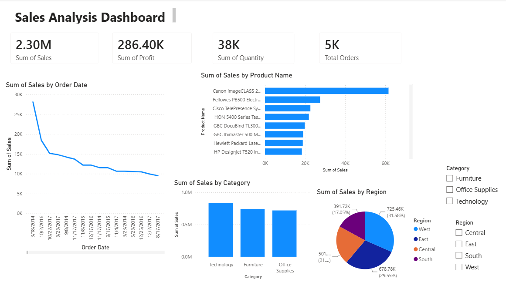

# Sales Analysis Dashboard using Power BI

## 📌 Project Overview
This project analyzes Superstore sales data using Microsoft Power BI. The dashboard provides key insights into sales, profit, quantity sold, categories, products, and regional performance.

---

## 📂 Dataset
Sample Superstore Dataset (.csv)

---

## 🛠 Tools Used
- Microsoft Power BI
- CSV Dataset
- Data Visualization

---

## 📊 Dashboard Features

- Total Sales
- Total Profit
- Total Quantity Sold
- Total Orders
- Sales Trend Over Time
- Sales by Category
- Sales by Product
- Sales by Region

---

## 📈 Key Insights

- Total Sales reached **2.30M**.
- Total Profit was **286.40K**.
- Technology generated the highest sales.
- West region contributed the highest sales.
- Canon products ranked among the top-selling products.

---

## 📷 Dashboard Preview

