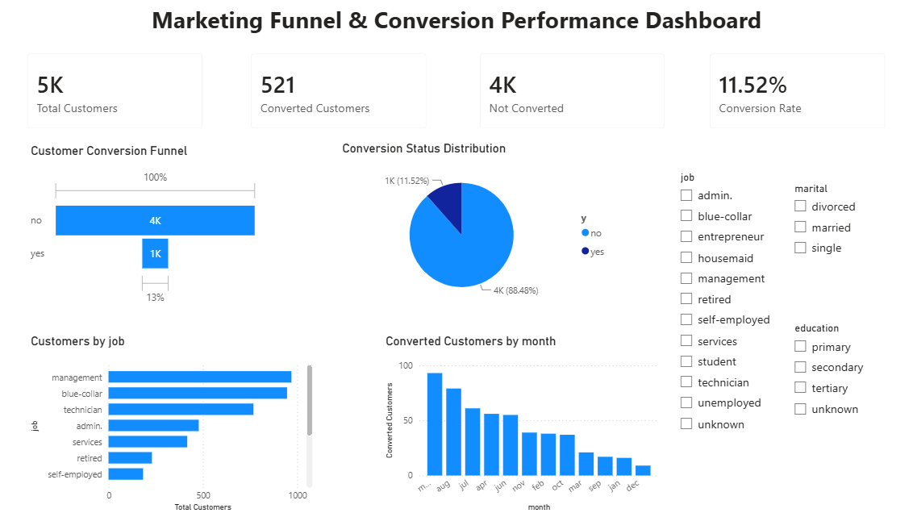

# Marketing Funnel & Conversion Performance Dashboard

## 📌 Project Overview
This project analyzes marketing funnel data to identify customer conversion trends, drop-off points, and overall campaign performance using Power BI.

The dashboard helps understand:
- Total Customers
- Converted Customers
- Non-Converted Customers
- Conversion Rate
- Customer Conversion Funnel
- Conversion Status Distribution
- Customers by Job
- Monthly Conversion Trends

## 🛠️ Tools Used
- Power BI
- Microsoft Excel (CSV Dataset)

## 📊 Dashboard Features
- KPI Cards for Total Customers, Converted Customers, Not Converted Customers, and Conversion Rate
- Funnel Chart for Customer Conversion
- Pie Chart showing Conversion Status Distribution
- Bar Chart displaying Customers by Job
- Column Chart showing Monthly Converted Customers
- Interactive Slicers for Job, Marital Status, and Education

## 📈 Key Insights
- Overall conversion rate is approximately **11.5%**.
- Most customers did not convert.
- Conversion performance varies across different months.
- Customer distribution differs significantly by job category.

## 📂 Files Included
- Marketing_Funnel_Dashboard.pbix
- Dashboard.png
- README.md

## 📷 Dashboard Preview

---
Created as part of the **Future Interns Data Science & Analytics Internship – Task 3**.
